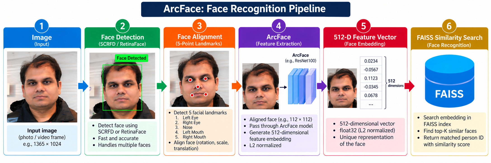

# ArcFace Face Recognition

A high-performance face recognition system built using **SCRFD**, **ArcFace**, and **FAISS** for large-scale face identification and surveillance applications.

---

## Overview

This project provides an end-to-end pipeline for:

- Face Detection
- Face Alignment
- Face Quality Assessment
- Duplicate Face Removal
- Face Embedding Generation
- FAISS Indexing
- Real-Time Face Recognition

The system is designed to work with thousands of identities and millions of face images.

---

## Architecture

<p align="center"></p>

---

## Features

### Face Detection

- SCRFD detector
- Fast and accurate
- Supports multiple faces per image
- Robust under varying lighting conditions

### Face Alignment

- Five-point landmark alignment
- Improves recognition accuracy
- Standardized face orientation

### Quality Assessment

Detects and filters:

- Blurry faces
- Low-resolution faces
- Extreme pose variations
- Overexposed images
- Underexposed images
- Occluded faces

### Duplicate Removal

Prevents:

- Multiple identical images
- Near-duplicate images
- Redundant embeddings

### Face Recognition

- ArcFace (512-D embeddings)
- Cosine similarity matching
- Large-scale identity search

### FAISS Integration

- Fast nearest-neighbor search
- Million-scale face databases
- Real-time recognition

---

## Dataset Structure

Recommended directory structure:

```text
database/
│
├── 1.Rakesh_Ranjan/
│   ├── img001.jpg
│   ├── img002.jpg
│   └── img003.jpg
│
├── 2.Amit_Kumar/
│   ├── img001.jpg
│   └── img002.jpg
│
├── 3.Ravi_Singh/
│   ├── img001.jpg
│   └── img002.jpg
│
└── ...
```

Directory naming convention:

```text
<PersonID>.<FirstName>_<LastName>
```

Example:

```text
101.Rakesh_Ranjan
```

---

## Technology Stack

| Component | Model |
|------------|---------|
| Face Detection | SCRFD |
| Face Alignment | InsightFace |
| Face Recognition | ArcFace |
| Embeddings | 512-D |
| Similarity Search | FAISS |
| Language | Python |
| Deep Learning | ONNX Runtime |

---

## Installation

### Clone Repository

```bash
git clone https://github.com/yourusername/arcface-recognition.git

cd arcface-recognition
```

---

### Create Virtual Environment

```bash
python -m venv venv

source venv/bin/activate
```

---

### Install Dependencies

```bash
pip install -r requirements.txt
```

---

## Required Packages

```bash
pip install insightface
pip install onnxruntime
pip install faiss-cpu
pip install opencv-python
pip install numpy
pip install tqdm
```

GPU version:

```bash
pip install onnxruntime-gpu
```

---

## Generate Face Embeddings

Example:

```python
import cv2
import insightface

app = insightface.app.FaceAnalysis(
    name="buffalo_l",
    providers=["CPUExecutionProvider"]
)

app.prepare(ctx_id=0)

img = cv2.imread("face.jpg")

faces = app.get(img)

embedding = faces[0].embedding

print(embedding.shape)
```

Output:

```text
(512,)
```

---

## Build FAISS Index

```python
import faiss

DIMENSION = 512

index = faiss.IndexFlatIP(DIMENSION)
```

Add embeddings:

```python
index.add(embeddings)
```

Save index:

```python
faiss.write_index(index, "face_index.faiss")
```

Load index:

```python
index = faiss.read_index("face_index.faiss")
```

---

## Face Recognition

Query image:

```text
Unknown Face
        │
        ▼
SCRFD
        │
        ▼
Alignment
        │
        ▼
ArcFace
        │
        ▼
512-D Embedding
        │
        ▼
FAISS Search
        │
        ▼
Top-K Matches
```

<p align="center"></p>

---

## Similarity Thresholds

Recommended starting thresholds:

| Similarity | Interpretation |
|------------|----------------|
| > 0.85 | Strong Match |
| 0.75 – 0.85 | Possible Match |
| < 0.75 | Different Person |

Thresholds should be tuned on your own dataset.

---

## Best Practices

### Face Images

Recommended:

- Frontal face
- Good lighting
- Sharp image
- Visible eyes
- No motion blur

Avoid:

- Heavy occlusion
- Extreme side profile
- Low-resolution crops
- Overexposed images

---

### Images Per Person

Recommended:

```text
Minimum: 20 images

Preferred: 50–100 images

Excellent: 200+ images
```

Include:

- Frontal
- Left profile
- Right profile
- Glasses
- Cap
- Indoor
- Outdoor
- Daylight
- Night

---

## Project Structure

```text
arcface-recognition/
│
├── database/
│
├── models/
│
├── indexes/
│
├── embeddings/
│
├── scripts/
│   ├── detect_faces.py
│   ├── align_faces.py
│   ├── quality_filter.py
│   ├── remove_duplicates.py
│   ├── generate_embeddings.py
│   ├── build_faiss.py
│   └── recognize.py
│
├── reports/
│
├── requirements.txt
│
└── README.md
```

---

## Performance

Typical performance using ArcFace:

| Dataset Size | Search Time |
|--------------|------------|
| 10,000 Faces | < 10 ms |
| 100,000 Faces | < 20 ms |
| 1,000,000 Faces | < 100 ms |

Depends on hardware and FAISS index type.

---

## Recommended Production Pipeline

```text
Raw Dataset
      │
      ▼
SCRFD
      │
      ▼
Alignment
      │
      ▼
Quality Filtering
      │
      ▼
Duplicate Removal
      │
      ▼
ArcFace Embeddings
      │
      ▼
FAISS Index
      │
      ▼
Real-Time Recognition
      │
      ▼
Alert / Investigation System
```

---

## Future Enhancements

- Face Quality Scoring
- Age Estimation
- Gender Classification
- Face Anti-Spoofing
- Multi-Camera Tracking
- Real-Time Surveillance Dashboard
- PostgreSQL Integration
- Django Web Interface
- Watchlist Alert System
- Distributed FAISS Cluster

---

## License

MIT License

---

## References

1. ArcFace: Additive Angular Margin Loss for Deep Face Recognition
2. InsightFace Framework
3. SCRFD Face Detector
4. FAISS Similarity Search Library
5. ONNX Runtime