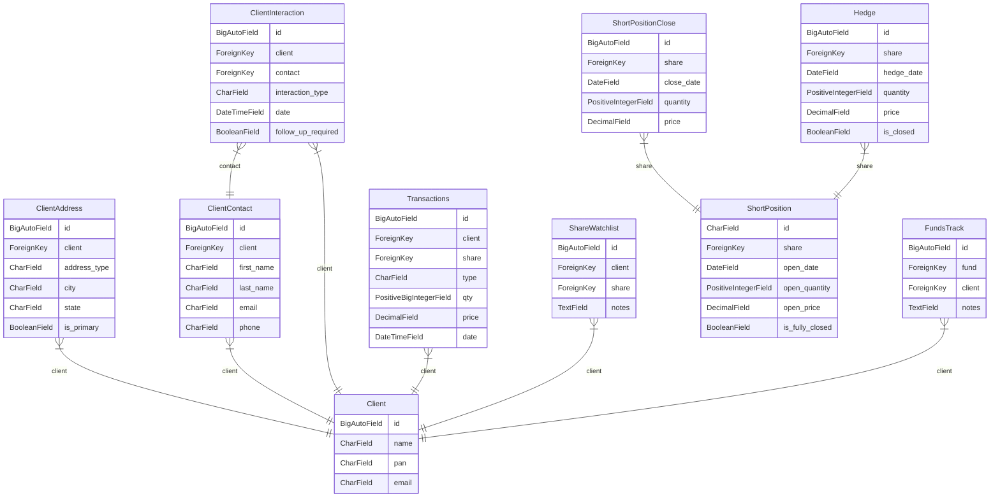

<strong>Click to expand Client CRM & Portfolio ER Diagram</strong>

```mermaid
erDiagram
    Client {
        BigAutoField id
        CharField name
        CharField pan
        CharField email
    }
    ClientAddress {
        BigAutoField id
        ForeignKey client
        CharField address_type
        CharField city
        CharField state
        BooleanField is_primary
    }
    ClientContact {
        BigAutoField id
        ForeignKey client
        CharField first_name
        CharField last_name
        CharField email
        CharField phone
    }
    ClientInteraction {
        BigAutoField id
        ForeignKey client
        ForeignKey contact
        CharField interaction_type
        DateTimeField date
        BooleanField follow_up_required
    }
    Transactions {
        BigAutoField id
        ForeignKey client
        ForeignKey share
        CharField type
        PositiveBigIntegerField qty
        DecimalField price
        DateTimeField date
    }
    ShareWatchlist {
        BigAutoField id
        ForeignKey client
        ForeignKey share
        TextField notes
    }
    FundsTrack {
        BigAutoField id
        ForeignKey fund
        ForeignKey client
        TextField notes
    }
    ShortPosition {
        CharField id
        ForeignKey share
        DateField open_date
        PositiveIntegerField open_quantity
        DecimalField open_price
        BooleanField is_fully_closed
    }
    ShortPositionClose {
        BigAutoField id
        ForeignKey share
        DateField close_date
        PositiveIntegerField quantity
        DecimalField price
    }
    Hedge {
        BigAutoField id
        ForeignKey share
        DateField hedge_date
        PositiveIntegerField quantity
        DecimalField price
        BooleanField is_closed
    }

    ClientAddress }|--|| Client : client
    ClientContact }|--|| Client : client
    ClientInteraction }|--|| Client : client
    ClientInteraction }|--|| ClientContact : contact
    Transactions }|--|| Client : client
    ShareWatchlist }|--|| Client : client
    FundsTrack }|--|| Client : client
    ShortPositionClose }|--|| ShortPosition : share
    Hedge }|--|| ShortPosition : share
```

