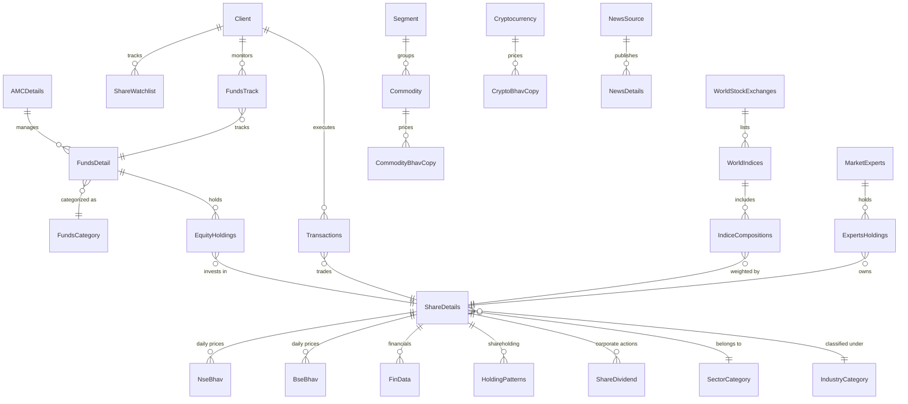

## Database Architecture Overview

```mermaid
erDiagram
    %% Core Entities
    ShareDetails ||--o{ NseBhav : "daily prices"
    ShareDetails ||--o{ BseBhav : "daily prices"
    ShareDetails ||--o{ FinData : "financials"
    ShareDetails ||--o{ HoldingPatterns : "shareholding"
    ShareDetails ||--o{ ShareDividend : "corporate actions"
    ShareDetails }o--|| SectorCategory : "belongs to"
    ShareDetails }o--|| IndustryCategory : "classified under"

    %% Mutual Funds & AMCs
    AMCDetails ||--o{ FundsDetail : "manages"
    FundsDetail }o--|| FundsCategory : "categorized as"
    FundsDetail ||--o{ EquityHoldings : "holds"
    EquityHoldings }o--|| ShareDetails : "invests in"

    %% Clients & Trading
    Client ||--o{ Transactions : "executes"
    Client ||--o{ ShareWatchlist : "tracks"
    Client ||--o{ FundsTrack : "monitors"
    Transactions }o--|| ShareDetails : "trades"
    FundsTrack }o--|| FundsDetail : "tracks"

    %% Indices, Commodities & Crypto
    WorldStockExchanges ||--o{ WorldIndices : "lists"
    WorldIndices ||--o{ IndiceCompositions : "includes"
    IndiceCompositions }o--|| ShareDetails : "weighted by"
    Segment ||--o{ Commodity : "groups"
    Commodity ||--o{ CommodityBhavCopy : "prices"
    Cryptocurrency ||--o{ CryptoBhavCopy : "prices"

    %% News & Experts
    NewsSource ||--o{ NewsDetails : "publishes"
    MarketExperts ||--o{ ExpertsHoldings : "holds"
    ExpertsHoldings }o--|| ShareDetails : "owns"
```
