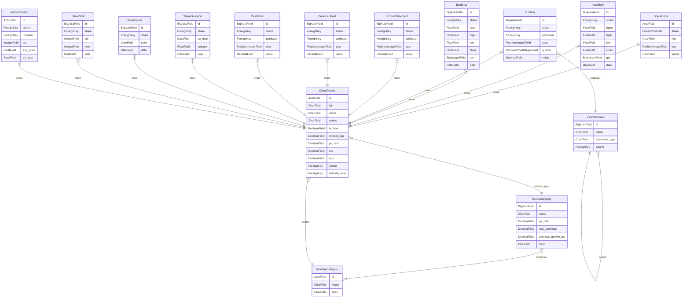

<strong>Click to expand Equities & Financials ER Diagram</strong>

```mermaid
erDiagram
    IndustryCategory {
        AutoField id
        CharField Name
        CharField Alias
    }
    SectorCategory {
        BigAutoField id
        CharField name
        DecimalField pe_ratio
        DecimalField total_earnings
        DecimalField earnings_growth_pct
        CharField trend
    }
    ShareDetails {
        AutoField id
        CharField isin
        CharField name
        CharField series
        BooleanField is_listed
        DecimalField market_cap
        DecimalField pe_ratio
        DecimalField roe
        DecimalField eps
        ForeignKey sector
        ForeignKey industry_type
    }
    ShareCode {
        AutoField id
        OneToOneField share
        CharField nse
        PositiveIntegerField bse
        CharField yahoo
    }
    NseBhav {
        BigAutoField id
        ForeignKey share
        FloatField open
        FloatField high
        FloatField low
        FloatField close
        BigIntegerField qty
        DateField date
    }
    BseBhav {
        BigAutoField id
        ForeignKey share
        FloatField open
        FloatField high
        FloatField low
        FloatField close
        BigIntegerField qty
        DateField date
    }
    FinParticulars {
        BigAutoField id
        CharField name
        CharField statement_type
        ForeignKey parent
    }
    FinData {
        BigAutoField id
        ForeignKey share
        ForeignKey particular
        PositiveIntegerField year
        PositiveSmallIntegerField quarter
        DecimalField value
    }
    IncomeStatement {
        BigAutoField id
        ForeignKey share
        ForeignKey particular
        PositiveIntegerField year
        DecimalField value
    }
    BalanceSheet {
        BigAutoField id
        ForeignKey share
        ForeignKey particular
        PositiveIntegerField year
        DecimalField value
    }
    CashFlow {
        BigAutoField id
        ForeignKey share
        ForeignKey particular
        PositiveIntegerField year
        DecimalField value
    }
    ShareDividend {
        BigAutoField id
        ForeignKey share
        DateField ex_date
        FloatField amount
        CharField type
    }
    ShareBonus {
        BigAutoField id
        ForeignKey share
        CharField ratio
        DateField date
    }
    ShareSplit {
        BigAutoField id
        ForeignKey share
        IntegerField old
        IntegerField new
        DateField date
    }
    InsiderTrading {
        AutoField id
        ForeignKey share
        ForeignKey investor
        IntegerField qty
        FloatField avg_price
        DateField ex_date
    }

    SectorCategory }|--|{ IndustryCategory : industries
    ShareDetails }|--|| IndustryCategory : sector
    ShareDetails }|--|| SectorCategory : industry_type
    ShareCode ||--|| ShareDetails : share
    NseBhav }|--|| ShareDetails : share
    BseBhav }|--|| ShareDetails : share
    FinParticulars }|--|| FinParticulars : parent
    FinData }|--|| ShareDetails : share
    FinData }|--|| FinParticulars : particular
    IncomeStatement }|--|| ShareDetails : share
    BalanceSheet }|--|| ShareDetails : share
    CashFlow }|--|| ShareDetails : share
    ShareDividend }|--|| ShareDetails : share
    ShareBonus }|--|| ShareDetails : share
    ShareSplit }|--|| ShareDetails : share
    InsiderTrading }|--|| ShareDetails : share
```

