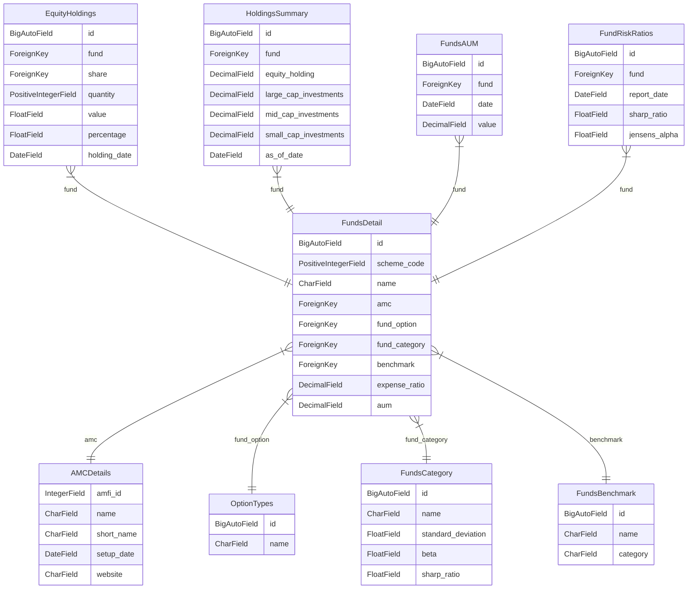

<strong>Click to expand Mutual Funds & AMC ER Diagram</strong>

```mermaid
erDiagram
    AMCDetails {
        IntegerField amfi_id
        CharField name
        CharField short_name
        DateField setup_date
        CharField website
    }
    FundsCategory {
        BigAutoField id
        CharField name
        FloatField standard_deviation
        FloatField beta
        FloatField sharp_ratio
    }
    FundsBenchmark {
        BigAutoField id
        CharField name
        CharField category
    }
    OptionTypes {
        BigAutoField id
        CharField name
    }
    FundsDetail {
        BigAutoField id
        PositiveIntegerField scheme_code
        CharField name
        ForeignKey amc
        ForeignKey fund_option
        ForeignKey fund_category
        ForeignKey benchmark
        DecimalField expense_ratio
        DecimalField aum
    }
    EquityHoldings {
        BigAutoField id
        ForeignKey fund
        ForeignKey share
        PositiveIntegerField quantity
        FloatField value
        FloatField percentage
        DateField holding_date
    }
    HoldingsSummary {
        BigAutoField id
        ForeignKey fund
        DecimalField equity_holding
        DecimalField large_cap_investments
        DecimalField mid_cap_investments
        DecimalField small_cap_investments
        DateField as_of_date
    }
    FundsAUM {
        BigAutoField id
        ForeignKey fund
        DateField date
        DecimalField value
    }
    FundRiskRatios {
        BigAutoField id
        ForeignKey fund
        DateField report_date
        FloatField sharp_ratio
        FloatField jensens_alpha
    }

    FundsDetail }|--|| AMCDetails : amc
    FundsDetail }|--|| OptionTypes : fund_option
    FundsDetail }|--|| FundsCategory : fund_category
    FundsDetail }|--|| FundsBenchmark : benchmark
    EquityHoldings }|--|| FundsDetail : fund
    HoldingsSummary }|--|| FundsDetail : fund
    FundsAUM }|--|| FundsDetail : fund
    FundRiskRatios }|--|| FundsDetail : fund
```

